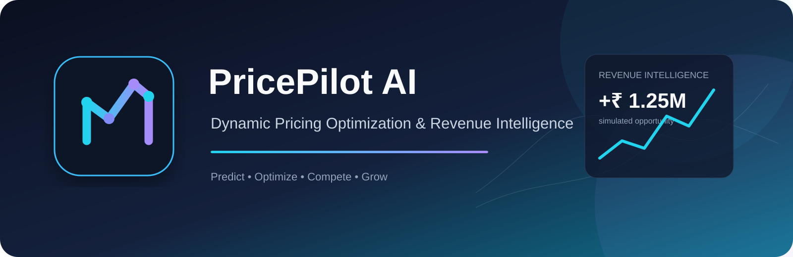
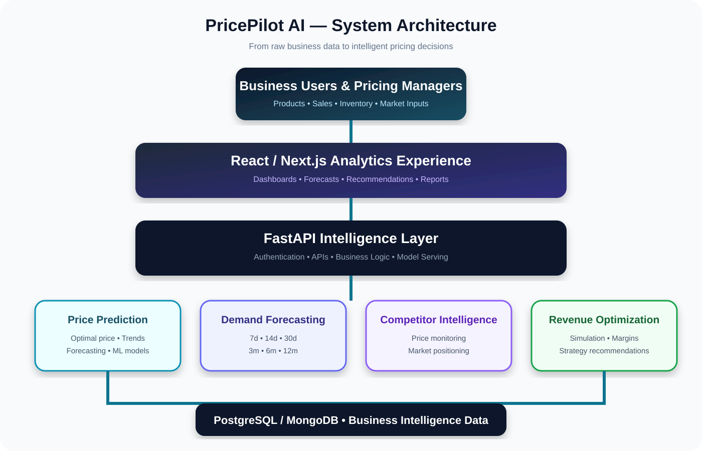
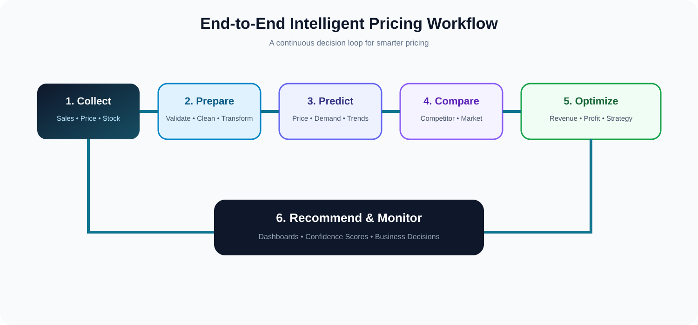
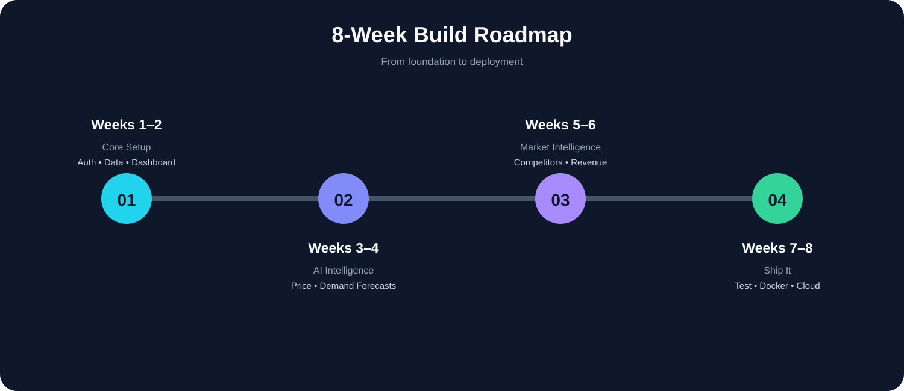

# 🚀 PricePilot AI

### Dynamic Pricing Optimization & Revenue Intelligence System

<p align="center">
  
</p>

<p align="center">
  <b>Predict demand. Understand the market. Optimize prices. Grow revenue.</b>
</p>

<p align="center">
  
  
  
  
  
</p>

---

## 🌟 What is PricePilot AI?

**PricePilot AI** is an AI-powered dynamic pricing and revenue intelligence platform that transforms business data into intelligent pricing decisions.

Instead of relying only on static pricing rules, the platform analyzes:

> 📈 Historical Sales + 🏷️ Pricing + 📦 Inventory + 🌦️ Seasonality + 🏪 Competitors + 📊 Market Trends

and converts them into:

> **Demand Forecasts → Price Intelligence → Revenue Optimization → Business Decisions**

The system is designed for e-commerce, retail, marketplaces, airlines, hotels, subscription businesses, and sales teams.

---

## 🧠 The Core Idea

### Traditional Pricing

```text
"Set a price → Wait → Check sales"
```

### PricePilot AI

```text
"Understand the market
        ↓
Forecast demand
        ↓
Analyze competition
        ↓
Simulate revenue
        ↓
Recommend the best pricing strategy"
```

---

## 🏗️ System Architecture

<p align="center">
  
</p>

---

## 🔄 End-to-End Workflow

<p align="center">
  
</p>

---

## ✨ Core Modules

| Module | Purpose |
|---|---|
| 🔐 User Management | Authentication, authorization, and role-based access |
| 📦 Product & Pricing Data | Product catalog, historical prices, sales data, and validation |
| 🤖 Price Prediction | Optimal price recommendations and price trend analysis |
| 📊 Demand Forecasting | Future demand prediction across multiple time horizons |
| 🏪 Competitor Analysis | Market comparison and competitive positioning |
| 💰 Revenue Optimization | Revenue simulation, profitability, and margin optimization |
| 📈 Analytics Dashboard | Business intelligence and pricing performance monitoring |

---

## 📊 Demand Forecasting Engine

The forecasting engine uses historical business and market signals to predict future demand.

### Forecasting Horizons

| Horizon | Period | Business Use |
|---|---|---|
| ⚡ Short-Term | 7 / 14 / 30 days | Inventory, daily pricing, promotions |
| 📅 Medium-Term | 3 / 6 months | Procurement, revenue, capacity planning |
| 🧭 Long-Term | 12 months | Strategic planning and expansion |

### Example Output

```text
Product: Product A
Forecast Period: Next 30 Days
Predicted Demand: 1,250 Units
Demand Trend: Increasing
Confidence Score: 88%
```

---

## 🧬 AI & Machine Learning

### Time-Series Models

- Prophet
- ARIMA

### Machine Learning Models

- XGBoost Regressor
- Random Forest Regressor

### Deep Learning

- LSTM Networks

### Model Inputs

```text
Historical Sales
       +
Product Prices
       +
Discounts & Promotions
       +
Seasonality & Holidays
       +
Inventory Levels
       +
Competitor Prices
       +
Market Trends
       ↓
AI Intelligence Layer
       ↓
Demand + Price + Revenue Insights
```

---

## 📥 Data Intelligence Pipeline

```text
RAW BUSINESS DATA
       ↓
Data Validation
       ↓
Data Cleaning
       ↓
Feature Engineering
       ↓
Model Training
       ↓
Prediction & Forecasting
       ↓
Recommendation Engine
       ↓
Analytics Dashboard
```

---

## 💡 What Makes PricePilot AI Different?

### 🎯 From Prediction to Decision

Many systems only predict what might happen.

**PricePilot AI goes further:**

```text
What is happening?
        ↓
What is likely to happen?
        ↓
What should the business do?
        ↓
What will be the revenue impact?
```

### 🔁 Continuous Intelligence Loop

```text
New Data
   ↓
New Prediction
   ↓
New Recommendation
   ↓
Business Action
   ↓
New Sales Data
   ↺
```

---

## 🛠️ Technology Stack

### Frontend

- React.js
- Next.js
- Tailwind CSS
- Chart.js
- Recharts

### Backend

- Python
- FastAPI
- JWT Authentication

### Database

- PostgreSQL
- MongoDB

### AI / ML

- Pandas
- NumPy
- Scikit-learn
- XGBoost
- Random Forest
- TensorFlow

### Forecasting

- Prophet
- ARIMA
- XGBoost Regressor
- Random Forest Regressor
- LSTM

### DevOps

- Docker
- Docker Compose
- AWS / Azure

### Development

- VS Code
- Git
- GitHub
- Postman

---

## 📁 Suggested Project Structure

```text
PricePilot-AI/
│
├── frontend/
│   ├── components/
│   ├── pages/
│   ├── services/
│   ├── charts/
│   └── package.json
│
├── backend/
│   ├── app/
│   │   ├── main.py
│   │   ├── api/
│   │   ├── models/
│   │   ├── schemas/
│   │   ├── services/
│   │   └── database/
│   ├── requirements.txt
│   └── Dockerfile
│
├── ml_models/
│   ├── price_prediction/
│   ├── demand_forecasting/
│   ├── competitor_analysis/
│   └── model_training/
│
├── datasets/
│   ├── sales/
│   ├── pricing/
│   ├── inventory/
│   └── market_data/
│
├── notebooks/
│   ├── data_analysis.ipynb
│   ├── price_prediction.ipynb
│   └── demand_forecasting.ipynb
│
├── assets/
│   ├── pricepilot-banner.svg
│   ├── system-architecture.svg
│   ├── workflow.svg
│   └── roadmap.svg
│
├── docker-compose.yml
├── README.md
└── LICENSE
```

---

## 🗺️ 8-Week Development Roadmap

<p align="center">
  
</p>

### Phase 01 — Weeks 1–2: Foundation

- Project architecture
- Database schema
- Authentication
- Role-based access
- Dataset integration
- Product management
- Pricing dashboard

### Phase 02 — Weeks 3–4: AI Intelligence

- Price prediction
- Optimal pricing recommendations
- Demand forecasting
- Trend classification
- Forecast confidence scoring

### Phase 03 — Weeks 5–6: Market Intelligence

- Competitor monitoring
- Pricing comparison
- Market intelligence
- Profitability analysis
- Revenue optimization

### Phase 04 — Weeks 7–8: Production Ready

- Model validation
- Recommendation testing
- Performance optimization
- Docker deployment
- Cloud deployment
- Final documentation

---

## 📏 Performance Metrics

### AI Model Performance

- Price Prediction Accuracy
- Demand Forecasting Accuracy
- Mean Absolute Error — MAE
- Root Mean Square Error — RMSE

### Business Performance

- Revenue Improvement Percentage
- Pricing Recommendation Effectiveness
- Demand Prediction Reliability

### System Performance

- Prediction Response Time
- Dashboard Loading Speed
- Concurrent User Handling

---

## 🐳 Deployment

### Run with Docker Compose

```bash
docker compose build
docker compose up -d
```

### Stop Services

```bash
docker compose down
```

The platform is designed for deployment on:

- AWS
- Microsoft Azure

---

## 🔐 Security

PricePilot AI is designed with:

- JWT-based authentication
- Role-based access control
- Protected API endpoints
- User authorization
- Data validation
- Secure business workflows

---

## 🎯 Project Vision

> **PricePilot AI aims to make pricing intelligent, adaptive, and data-driven.**

The goal is not simply to predict the future.

The goal is to help businesses make **better decisions before the future arrives.**

---

## 🚧 Project Status

**Under Development**

The platform is being developed through a structured 8-week implementation plan covering:

```text
Architecture
    ↓
Data Engineering
    ↓
Machine Learning
    ↓
Demand Forecasting
    ↓
Competitor Intelligence
    ↓
Revenue Optimization
    ↓
Testing
    ↓
Cloud Deployment
```

---

## 👨‍💻 Author

### S. Ameer Hussain

**B.Tech — Data Science Engineering**  
Santhiram Engineering College, Nandyal

---

## ⭐ Support the Project

If you find **PricePilot AI** interesting or useful, consider giving this repository a ⭐ on GitHub.

---

## 📄 License

This project is intended for educational, research, and development purposes.
